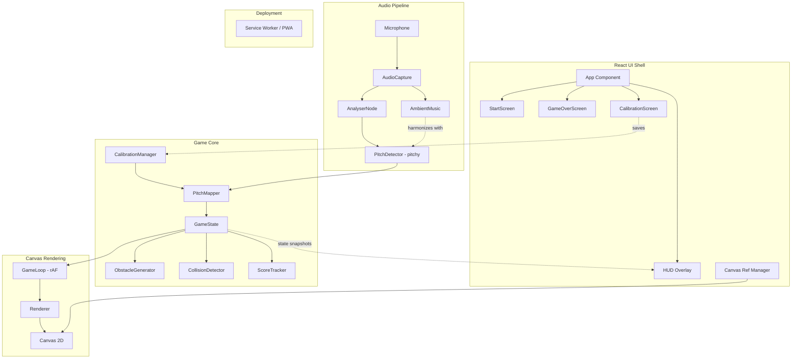
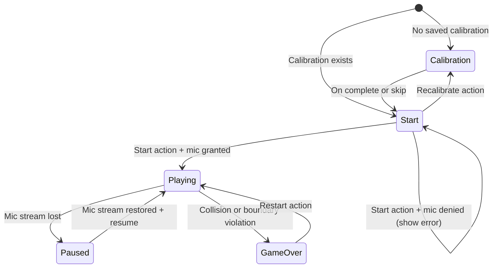
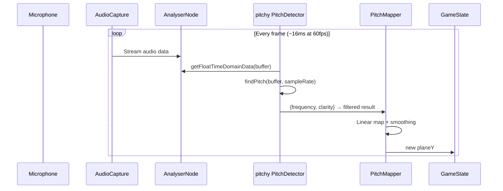
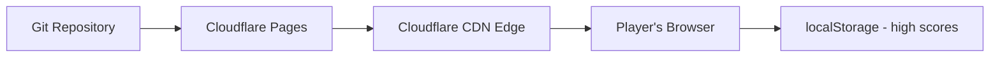

# Design Document: Humming Paper Plane

## Overview

The Humming Paper Plane is a browser-based game where the player controls a paper plane's altitude by humming into their microphone. The game uses the Web Audio API to capture real-time audio, the `pitchy` npm package for pitch detection, and maps detected frequency to the plane's vertical position on an HTML5 Canvas. The plane auto-scrolls through a procedurally generated obstacle course, and the player survives as long as possible while accumulating a score.

The architecture prioritizes low-latency audio processing (< 50ms from hum to plane movement), smooth rendering at 30+ fps, and a clean separation between the audio pipeline, game core, and rendering — using simple module boundaries appropriate for a client-side game.

**Key Technology Choices:**
- **Vite + TypeScript** — fast dev/build toolchain with type safety
- **React** — thin UI shell only (start screen, game-over screen, HUD overlay, canvas ref management)
- **HTML5 Canvas 2D** — immediate-mode rendering for the game loop, completely decoupled from React's render cycle
- **Web Audio API** — microphone capture and audio analysis via `AnalyserNode`
- **Pitchy** — npm package providing `PitchDetector` class wrapping autocorrelation-based pitch detection (replaces custom YIN implementation)
- **requestAnimationFrame** — frame-rate-independent game loop with delta-time accumulation
- **Cloudflare Pages** — static site deployment from git (no server infrastructure)

**Deployment:** Static site on Cloudflare Pages. All game logic is client-side. No backend, no microservices, no database for core gameplay.

## Architecture



### Separation of Concerns

The system uses three independent layers with simple module boundaries:

1. **React UI Shell** — manages responsive layout, start/game-over screens as React components, the `<canvas>` element ref, and a score/pitch HUD overlay. React never drives the game loop and never re-renders per-frame. It receives state snapshots (score, game status) via a lightweight callback or ref-based bridge.

2. **Canvas Game Loop** — runs via `requestAnimationFrame`, completely decoupled from React's render cycle. Owns the update → render pipeline. Reads pitch data from the audio pipeline, updates game state, and draws to canvas each frame.

3. **Audio Pipeline** — captures microphone input and produces a frequency (or null) each frame using the `pitchy` PitchDetector.

### Data Flow

1. Audio Pipeline captures microphone → `pitchy` detects pitch → produces frequency or null.
2. Game Loop reads current pitch, updates plane altitude, scrolls world, generates/removes obstacles, checks collisions, updates score.
3. Renderer draws current game state to canvas.
4. React shell observes game status changes (playing → game-over) to show/hide screens.

All game logic is frame-rate independent using delta-time calculations.

## Components and Interfaces

### AudioCapture

```typescript
interface AudioCapture {
  /** Request microphone access. Resolves when stream is ready. */
  init(): Promise<void>;
  /** Get the current AnalyserNode for frequency data extraction. */
  getAnalyser(): AnalyserNode;
  /** Get the AudioContext sample rate. */
  getSampleRate(): number;
  /** Check if audio stream is active. */
  isActive(): boolean;
  /** Register callback for stream interruption. */
  onStreamLost(callback: () => void): void;
  /** Attempt to resume a lost stream. */
  resume(): Promise<void>;
  /** Release microphone resources. */
  dispose(): void;
}
```

**Responsibilities:** Manages `navigator.mediaDevices.getUserMedia`, creates an `AudioContext` and `AnalyserNode`, monitors stream health. Handles `AudioContext` suspension (browser autoplay policy) by resuming on user interaction.

### PitchDetection (using pitchy)

```typescript
import { PitchDetector } from 'pitchy';

interface PitchResult {
  frequency: number | null;  // Hz, or null if no valid pitch
  clarity: number;           // 0-1 clarity/confidence score from pitchy
}

interface PitchDetection {
  /** Create and configure the pitchy PitchDetector instance. */
  init(sampleRate: number, bufferSize: number): void;
  /** Analyze current audio buffer and return detected pitch. */
  detect(analyser: AnalyserNode): PitchResult;
}
```

**Responsibilities:** Wraps the `pitchy` npm package's `PitchDetector.forFloat32Array(bufferSize)`. Each frame, copies time-domain data from the AnalyserNode into a Float32Array, calls `detector.findPitch(buffer, sampleRate)`, and filters results:
- Returns `null` if clarity is below the confidence threshold (0.85)
- Returns `null` if detected frequency is outside [80, 500] Hz
- Otherwise returns the detected frequency

**Why pitchy:** The `pitchy` package provides a well-tested autocorrelation-based pitch detector (similar to YIN/McLeod). It handles the math internally, reducing code we need to maintain and test. We test our wrapper logic (filtering, thresholding) rather than reimplementing pitch detection from scratch.

### PitchMapper

```typescript
interface PitchMapper {
  /** Map a frequency to a target altitude (0 = bottom, canvasHeight = top). */
  mapToAltitude(
    frequency: number | null,
    currentAltitude: number,
    deltaTime: number,
    canvasHeight: number
  ): number;
}
```

**Responsibilities:**
- Linear interpolation: `altitude = ((freq - 80) / (500 - 80)) * canvasHeight`
- Null pitch: descend at constant rate (150 px/s max)
- Smoothing: clamp per-frame altitude change to 10% of canvas height
- Out-of-range clamping to boundaries

### GameState

```typescript
interface GameState {
  status: 'start' | 'playing' | 'paused' | 'gameover';
  planeY: number;
  planeX: number;
  score: number;
  scrollOffset: number;
  obstacles: Obstacle[];
  difficulty: DifficultyConfig;
  elapsedTime: number;
}

interface Obstacle {
  x: number;
  gapY: number;        // center of the gap
  gapHeight: number;   // height of the gap opening
  width: number;
  passed: boolean;     // whether plane has passed this obstacle
}

interface DifficultyConfig {
  gapMultiplier: number;      // starts at 1.5, decreases to 1.2
  spawnInterval: number;      // starts at 3s, decreases to 1s
  currentTime: number;        // time since game start for scaling
}
```

### ObstacleGenerator

```typescript
interface ObstacleGenerator {
  /** Update and potentially spawn new obstacles. Returns updated obstacle array. */
  update(
    state: GameState,
    deltaTime: number,
    canvasHeight: number,
    planeHeight: number
  ): Obstacle[];
  /** Reset to initial difficulty. */
  reset(): void;
}
```

**Responsibilities:** Procedural obstacle generation with increasing difficulty. Ensures gap constraints are met (≥ 1.2× plane height minimum, gap center at least one plane height from edges). Removes obstacles that have scrolled off-screen.

### CollisionDetector

```typescript
interface AABB {
  x: number;
  y: number;
  width: number;
  height: number;
}

interface CollisionDetector {
  /** Check if plane AABB overlaps any obstacle AABB. */
  checkObstacleCollision(plane: AABB, obstacles: Obstacle[]): boolean;
  /** Check if plane is fully outside canvas bounds. */
  checkBoundaryViolation(plane: AABB, canvasHeight: number): boolean;
}
```

**Responsibilities:** AABB overlap detection each frame. Simple rectangle intersection: two rectangles overlap if and only if they overlap on both axes simultaneously.

### ScoreTracker

```typescript
interface ScoreTracker {
  /** Update score based on scroll distance this frame. */
  addScrollScore(pixelsScrolled: number): void;
  /** Add obstacle pass bonus. */
  addObstacleBonus(): void;
  /** Get current score. */
  getScore(): number;
  /** Save high score to localStorage. */
  saveHighScore(score: number): void;
  /** Get high score from localStorage. */
  getHighScore(): number;
  /** Reset score to 0. */
  reset(): void;
}
```

**Responsibilities:** Accumulates fractional scroll distance, awards 1 point per 10 pixels scrolled. Adds 10 bonus points when plane passes an obstacle. Persists high score to `localStorage`.

### Renderer

```typescript
interface Renderer {
  /** Clear and redraw the entire game frame. */
  render(state: GameState, ctx: CanvasRenderingContext2D): void;
}
```

**Responsibilities:** Draws the plane (hand-drawn paper plane style), obstacles (sketch-style columns), scrolling background with parallax, and score HUD. Uses Canvas 2D API with bezier curves and slight randomization for hand-drawn feel. Does NOT render start/game-over screens (those are React components — including CalibrationScreen). The Renderer implements the visual identity described in the Visual Identity section — sky gradient background with parallax layers, white paper plane with tilt animation and trail, cloud-style obstacles, and score pop effects.

### GameLoop

```typescript
interface GameLoop {
  /** Start the loop. */
  start(): void;
  /** Stop the loop. */
  stop(): void;
  /** Register the update function called each frame with delta time in seconds. */
  onUpdate(callback: (deltaTime: number) => void): void;
}
```

**Responsibilities:** Uses `requestAnimationFrame`, calculates delta time between frames, caps delta time to prevent spiral of death (max 100ms per frame). Drives the update → render cycle independently of React.

### React Shell Components

```typescript
// App.tsx - top-level layout
// Manages game status and conditionally renders screens

// StartScreen.tsx - shown when status === 'start'
// Props: onStart callback
// Updated to show "Daily Challenge" button and "Recalibrate" option

// CalibrationScreen.tsx - shown when no calibration exists or player requests recalibration
// Props: onComplete(CalibrationData), onSkip callbacks
// Guides player through humming low note then high note with visual feedback

// GameOverScreen.tsx - shown when status === 'gameover'
// Props: score, highScore, onRestart callback

// HUD.tsx - overlay during gameplay
// Props: score, pitchIndicator (visual feedback of current pitch)

// GameCanvas.tsx - manages canvas ref and game loop lifecycle
// Creates canvas element, passes ref to game loop on mount, cleans up on unmount
```

**Design rationale:** React handles what it's good at — declarative UI, responsive layout, component lifecycle. The canvas game loop runs in a `useEffect` with a ref, never triggering React re-renders during gameplay. State flows one-way: game loop → React (via callbacks for status changes and score updates for HUD).

### CalibrationScreen

```typescript
interface CalibrationData {
  lowFrequency: number;   // Player's lowest comfortable humming frequency in Hz
  highFrequency: number;  // Player's highest comfortable humming frequency in Hz
  timestamp: number;      // When calibration was performed
}

interface CalibrationManager {
  /** Check if calibration data exists in localStorage. */
  hasCalibration(): boolean;
  /** Get stored calibration data, or null if none exists. */
  getCalibration(): CalibrationData | null;
  /** Save calibration data to localStorage. */
  saveCalibration(data: CalibrationData): void;
  /** Clear existing calibration data. */
  clearCalibration(): void;
  /** Get the effective pitch range (calibrated or default). */
  getEffectiveRange(): { min: number; max: number };
}
```

**Responsibilities:** During calibration, the player hums their lowest note for 2 seconds (system captures the average stable frequency) then their highest note for 2 seconds. The system adds a 10% buffer on each side to account for variation. If calibrated range is less than 100 Hz wide, fall back to defaults. The CalibrationScreen is a React component; the CalibrationManager is a pure logic module. PitchMapper reads the effective range from CalibrationManager instead of using hardcoded 80-500 Hz.

### AmbientMusic

```typescript
interface AmbientMusic {
  /** Initialize oscillators in the existing AudioContext. */
  init(audioContext: AudioContext): void;
  /** Update harmonizing tone based on current detected pitch. */
  update(currentFrequency: number | null): void;
  /** Start ambient music playback. */
  start(): void;
  /** Stop ambient music playback. */
  stop(): void;
  /** Mute/unmute toggle. */
  setMuted(muted: boolean): void;
  /** Check if muted. */
  isMuted(): boolean;
  /** Dispose oscillators and nodes. */
  dispose(): void;
}
```

**Responsibilities:** Creates 2-3 oscillators (sine/triangle waves) in the existing AudioContext. When player pitch is detected, sets oscillator frequencies to harmonizing intervals (perfect fifth below = frequency × 2/3, octave below = frequency / 2). When null pitch, plays a gentle drone at 110 Hz. Volume is set to -20dB below input level via GainNode. Smooth frequency transitions using `setTargetAtTime` to avoid clicks. Stops/disposes on game-over or pause.

### DailyChallenge (Seeded RNG)

```typescript
interface SeededRNG {
  /** Create a seeded random number generator from a date string. */
  create(seed: string): () => number;
}
```

**Responsibilities:** Implements a simple seeded pseudo-random number generator (mulberry32 or similar). The seed is the current date as `YYYY-MM-DD` string, hashed to a 32-bit integer. The ObstacleGenerator accepts an optional RNG function — if provided (daily challenge mode), it uses the seeded RNG instead of Math.random() for gap positioning. This produces identical obstacle layouts for all players on the same day. Standard mode continues to use Math.random().

Daily challenge scores are stored in localStorage under a separate key: `dailyScore_YYYY-MM-DD`.

### PWA Configuration

No new runtime component needed. Configuration-only:
- `public/manifest.json` — app name "HumPilot", icons (192×192, 512×512), theme color matching sky gradient, display: "standalone", orientation: "any"
- `vite-plugin-pwa` generates the service worker automatically with precaching of all build assets
- Service worker strategy: "CacheFirst" for static assets, "NetworkFirst" for manifest/updates
- Update prompt: When a new version is detected, show a non-intrusive "Update available" toast on start screen. Player can dismiss or refresh.

## Data Models

### Core Constants

```typescript
const GAME_CONFIG = {
  CANVAS_MIN_WIDTH: 800,
  CANVAS_MIN_HEIGHT: 600,
  ASPECT_RATIO: 800 / 600,       // 4:3

  // Audio
  SAMPLE_RATE: 44100,
  FFT_SIZE: 2048,
  MIN_FREQUENCY: 80,              // Hz
  MAX_FREQUENCY: 500,             // Hz
  CLARITY_THRESHOLD: 0.85,        // pitchy clarity threshold

  // Plane
  PLANE_WIDTH: 48,
  PLANE_HEIGHT: 32,
  PLANE_X_RATIO: 0.2,            // 20% from left edge

  // Physics
  SCROLL_SPEED: 200,              // pixels per second
  DESCENT_RATE: 150,              // pixels per second when no pitch
  MAX_ALTITUDE_CHANGE_RATIO: 0.1, // 10% of canvas height per frame

  // Obstacles
  INITIAL_GAP_MULTIPLIER: 1.5,
  MIN_GAP_MULTIPLIER: 1.2,
  INITIAL_SPAWN_INTERVAL: 4,      // seconds
  MIN_SPAWN_INTERVAL: 1,          // seconds
  MAX_SPAWN_INTERVAL: 4,          // seconds
  OBSTACLE_WIDTH: 60,

  // Scoring
  POINTS_PER_10_PIXELS: 1,
  OBSTACLE_BONUS: 10,

  // Difficulty
  DIFFICULTY_INCREASE_RATE: 0.02, // per second

  // Visual
  PLANE_TILT_MAX_DEG: 15,          // max tilt angle in degrees
  TRAIL_LENGTH: 15,                 // number of trail positions to render
  SCORE_POP_INTERVAL: 50,          // points between pop animations
  SCORE_POP_DURATION: 400,         // milliseconds for pop animation
  SCREEN_SHAKE_DURATION: 300,      // milliseconds on collision
  SCREEN_SHAKE_INTENSITY: 4,       // pixels of random offset

  // Colors
  SKY_TOP_COLOR: '#87CEEB',
  SKY_BOTTOM_COLOR: '#FFDAB9',
  PLANE_COLOR: '#FFFFFF',
  PLANE_FOLD_COLOR: '#D3D3D3',
  OBSTACLE_FILL_COLOR: '#B0C4DE',
  OBSTACLE_EDGE_COLOR: '#778899',
  HILL_COLOR: '#8FBC8F',
  TREE_COLOR: '#6B8E23',
  HUD_TEXT_COLOR: '#333333',
  SCORE_POP_COLOR: '#DAA520',

  // Calibration
  CALIBRATION_DURATION: 2,           // seconds per note capture
  CALIBRATION_BUFFER_PERCENT: 0.1,   // 10% buffer on each side
  MIN_CALIBRATION_RANGE: 100,        // Hz minimum range width

  // Ambient Music
  AMBIENT_VOLUME_DB: -20,            // dB below input level
  AMBIENT_DRONE_FREQ: 110,           // Hz drone when no pitch detected
  AMBIENT_TRANSITION_TIME: 0.1,      // seconds for smooth frequency change

  // Daily Challenge
  DAILY_SCORE_KEY_PREFIX: 'dailyScore_',
} as const;
```

### Data Persistence Strategy

- **High scores:** `localStorage` — simple key-value store, no server needed
- **Future leaderboard (optional):** Cloudflare D1 (free SQLite at the edge) — would require a minimal Cloudflare Worker function to read/write scores. Not part of core gameplay; noted as a future enhancement only.

### Game State Flow



### Audio Processing Pipeline



### Deployment Architecture



- **Build:** `vite build` produces static assets (HTML, JS, CSS)
- **Deploy:** Cloudflare Pages auto-deploys on push to main branch
- **No server:** All game logic runs in the browser. No API calls during gameplay.

## Visual Identity and Aesthetics

### Color Palette

- **Sky Background**: Soft gradient from light sky blue (#87CEEB) at top to warm peach/sunset (#FFDAB9) at bottom. The gradient shifts warmer (more orange/pink tones) as elapsed time increases, giving a visual sense of journey/progression.
- **Paper Plane**: Clean white (#FFFFFF) with subtle light gray (#D3D3D3) fold lines. The plane has a slight paper texture feel drawn with canvas paths.
- **Obstacles**: Styled as cloud columns — soft rounded shapes in muted sky-gray (#B0C4DE) with darker edges (#778899). They look like puffy cloud banks the plane must navigate through gaps in. Friendly, not threatening.
- **Parallax Background Layers**:
  - Far layer: Distant rolling hills in soft sage green (#8FBC8F), moving at 30% scroll speed
  - Mid layer: Gentle tree silhouettes in muted olive (#6B8E23), moving at 60% scroll speed
  - Near layer: Wispy cloud wisps in semi-transparent white, moving at 80% scroll speed
- **HUD Text**: Dark charcoal (#333333) with white outline for readability against the sky
- **Score Milestones**: Warm gold (#DAA520) flash/pop animation every 50 points
- **Game Over overlay**: Semi-transparent white blur backdrop with centered text

### Engagement Mechanics (within game loop)

- **Plane tilt animation**: The plane rotates slightly (±15°) based on vertical velocity — tilts up when ascending, tilts down when descending. Gives immediate visual feedback of movement direction.
- **Screen shake on collision**: When game ends, canvas shakes for 300ms (random offset ±4px each frame) before showing game-over screen. Satisfying impact feel.
- **Score pop animation**: Every 50 points, the score briefly scales up (1.0 → 1.3 → 1.0 over 400ms) with a gold color flash.
- **Trail effect**: Faint dotted trail behind the plane (last 15 positions) that fades out, showing recent flight path.
- **Progressive sky color**: Background gradient slowly shifts from morning blue to warm sunset as elapsed time increases (over ~2 minutes), creating a subconscious sense of progress and beauty.
- **"One more try" psychology**: Game-over screen prominently shows current score vs best score. If current > best, show a celebratory "New Best!" text. Always show a "Tap to try again" prompt.
- **Forgiving start**: First obstacle appears after 4-5 seconds (not 2-3), giving new players time to understand the pitch→altitude mapping before challenge begins.

### Accessibility for All Ages

- **Large touch targets**: Start and restart buttons are at least 48×48px (WCAG touch target guidelines)
- **Readable text**: Minimum 18px font size for all game text, bold weight for scores
- **One-action start**: Single click/tap begins the game (after mic permission)
- **Visual pitch indicator**: A small vertical bar on the left edge of the canvas shows current detected pitch level, so players immediately understand the mapping between their voice and the plane
- **High contrast**: All text has sufficient contrast ratio against backgrounds (4.5:1 minimum)
- **No flashing content**: No elements flash more than 3 times per second
- **Simple instructions**: Start screen shows a simple illustration: "Hum high → plane goes up. Hum low → plane goes down. Dodge the clouds!"
- **Colorblind-safe**: The design does not rely on color alone to convey information. Obstacles are distinguishable by shape and position, not just color.

## Correctness Properties

*A property is a characteristic or behavior that should hold true across all valid executions of a system — essentially, a formal statement about what the system should do. Properties serve as the bridge between human-readable specifications and machine-verifiable correctness guarantees.*

### Property 1: Pitch Detection Accuracy

*For any* synthetic sine wave signal with a frequency in the range [80, 500] Hz fed into the PitchDetection wrapper, the detected frequency SHALL be within ±3 Hz of the actual frequency.

**Validates: Requirements 2.2**

### Property 2: Invalid Audio Yields Null

*For any* audio buffer that either contains no detectable pitched tone (silence, random noise, amplitude below confidence threshold) OR contains a pitched frequency outside [80, 500] Hz, the PitchDetection wrapper SHALL output a null value.

**Validates: Requirements 2.4, 2.5**

### Property 3: Linear Pitch-to-Altitude Mapping

*For any* frequency f in [80, 500] Hz and any canvas height h, the mapped altitude SHALL equal `((f - 80) / (500 - 80)) * h`, and for any frequency outside [80, 500], the altitude SHALL be clamped to the nearest boundary (0 or h).

**Validates: Requirements 3.1, 3.2, 3.3, 3.6**

### Property 4: Null-Pitch Descent Rate

*For any* current altitude and any positive delta time, when the PitchDetection wrapper outputs null, the plane's new altitude SHALL be at most `currentAltitude - (150 * deltaTime)` (descending no faster than 150 px/s), and SHALL not go below 0.

**Validates: Requirements 3.4**

### Property 5: Altitude Change Smoothing Cap

*For any* pair of (currentAltitude, targetAltitude) and any canvas height, the actual altitude change applied in a single frame SHALL NOT exceed 10% of the canvas height.

**Validates: Requirements 3.5**

### Property 6: World Scroll Consistency

*For any* positive delta time and any game-world element with position x, after one update tick the element's new x-position SHALL equal `x - (200 * deltaTime)`.

**Validates: Requirements 4.2, 4.5**

### Property 7: Obstacle Generation Constraints

*For any* obstacle generated at any difficulty level, the following invariants SHALL hold simultaneously: (a) the gap height ≥ max(currentGapMultiplier, 1.2) × planeHeight, (b) the gap center is at least one planeHeight from both the top and bottom canvas edges, and (c) the gap multiplier ≥ 1.2 and spawn interval ≥ 1 second.

**Validates: Requirements 5.1, 5.3, 5.4**

### Property 8: Obstacle Spawn Interval Bounds

*For any* sequence of consecutively spawned obstacles during initial difficulty, the time interval between them (measured by horizontal distance / scroll speed) SHALL be between 2 and 4 seconds inclusive.

**Validates: Requirements 5.2**

### Property 9: AABB Collision Detection Correctness

*For any* two axis-aligned bounding rectangles A and B, the CollisionDetector SHALL report overlap if and only if `A.x < B.x + B.width AND A.x + A.width > B.x AND A.y < B.y + B.height AND A.y + A.height > B.y`.

**Validates: Requirements 6.1**

### Property 10: Boundary Violation Detection

*For any* plane bounding rectangle and canvas height, the CollisionDetector SHALL report a boundary violation if and only if the plane's bottom edge is above the canvas top (plane.y + plane.height < 0) OR the plane's top edge is below the canvas bottom (plane.y > canvasHeight).

**Validates: Requirements 6.3**

### Property 11: Distance-Based Scoring

*For any* non-negative scroll distance d pixels, the score increment SHALL equal `floor(d / 10)`.

**Validates: Requirements 7.1**

### Property 12: Game State Reset Invariants

*For any* game state (regardless of current score, plane position, obstacles, or difficulty), after a reset operation the score SHALL be 0, the plane altitude SHALL be at the initial position, the obstacle array SHALL be empty, and difficulty parameters SHALL equal their initial values.

**Validates: Requirements 8.6**

### Property 13: Canvas Aspect Ratio Preservation

*For any* viewport dimensions (width, height), the canvas SHALL scale to fill the viewport while maintaining the game's aspect ratio (4:3), meaning the actual rendered aspect ratio SHALL equal 800/600 within floating-point tolerance.

**Validates: Requirements 9.5**

### Property 14: Calibrated Pitch Mapping

*For any* calibration data with lowFrequency L and highFrequency H where H - L ≥ 100 Hz, and for any frequency f in [L, H], the mapped altitude SHALL equal `((f - L) / (H - L)) * canvasHeight`.

**Validates: Requirements 11.3**

### Property 15: Daily Seed Determinism

*For any* date string in YYYY-MM-DD format, calling the seeded RNG with the same seed SHALL produce the identical sequence of values on every invocation, and different date strings SHALL produce different sequences.

**Validates: Requirements 13.2**

### Property 16: Ambient Music Frequency Harmonization

*For any* valid player pitch frequency f, the ambient oscillator frequency SHALL equal either f/2 (octave below) or f × 2/3 (perfect fifth below), and when pitch is null, the oscillator SHALL play at 110 Hz.

**Validates: Requirements 12.2, 12.3**

## Error Handling

### Audio Errors

| Error Condition | Handling Strategy |
|---|---|
| Microphone permission denied | Display explanatory message in React StartScreen, remain on start screen, allow retry |
| Browser lacks getUserMedia | Display "browser not supported" message, block gameplay |
| Audio stream interrupted mid-game | Pause game loop, show notification via React overlay, offer resume option |
| AudioContext suspended (browser autoplay policy) | Resume AudioContext on first user click/tap via React event handler |

### Performance Degradation

| Condition | Handling Strategy |
|---|---|
| Frame rate < 20 fps for > 3 seconds | Reduce visible obstacles, simplify visual effects |
| Pitch detection clarity consistently low | Show visual indicator in HUD that microphone input is weak |
| Delta time spike (> 100ms) | Cap delta time to 100ms to prevent physics tunneling |

### Game Logic Edge Cases

| Condition | Handling Strategy |
|---|---|
| Plane at exact canvas boundary | Clamp to boundary, do not trigger game-over unless fully outside |
| Simultaneous collision + boundary violation | Process collision first (same frame), transition to game-over once |
| Obstacle gap at extreme canvas edge | Generator enforces minimum margin from edges |
| localStorage unavailable (private browsing) | Gracefully degrade — no high score persistence, game still works |

## Testing Strategy

### Property-Based Tests (Vitest + fast-check)

The project uses **Vitest** as the test runner and **fast-check** as the property-based testing library. Each property test maps to a Correctness Property defined above.

**Configuration:**
- Minimum 100 iterations per property test
- Each test tagged with: `Feature: humming-paper-plane, Property {number}: {property_text}`

**Testable modules for PBT:**
- `PitchDetection.detect()` — Properties 1, 2 (using synthetic audio buffers)
- `PitchMapper.mapToAltitude()` — Properties 3, 4, 5, 14
- `scrollUpdate()` — Property 6
- `ObstacleGenerator.update()` — Properties 7, 8
- `CollisionDetector.checkObstacleCollision()` — Property 9
- `CollisionDetector.checkBoundaryViolation()` — Property 10
- `ScoreTracker.addScrollScore()` — Property 11
- `GameState.reset()` — Property 12
- `canvasResize()` — Property 13
- `CalibrationManager.getEffectiveRange()` + `PitchMapper` — Property 14
- `SeededRNG.create()` — Property 15
- `AmbientMusic.update()` — Property 16

### Unit Tests (Vitest)

Example-based tests for:
- State machine transitions (start → playing, playing → game-over, game-over → playing)
- Microphone permission denial handling
- Stream interruption and recovery
- Obstacle removal when off-screen
- Obstacle pass bonus scoring
- Initial plane positioning within left third of canvas
- React component rendering (StartScreen, GameOverScreen, HUD, CalibrationScreen)
- localStorage high score read/write and graceful fallback
- CalibrationManager: save/load/clear calibration data in localStorage
- CalibrationManager: fallback to defaults when range < 100 Hz
- AmbientMusic: start/stop lifecycle tied to game state transitions
- AmbientMusic: mute/unmute toggle
- SeededRNG: same date produces same sequence (determinism smoke test)
- Daily challenge score saved separately from standard mode score
- PWA manifest validation (required fields present)

### Integration / Cross-Browser Tests (Playwright)

- End-to-end audio pipeline: mock microphone → AnalyserNode → pitchy → PitchMapper
- Full game loop tick: verify state updates correctly from one frame to next
- Cross-browser compatibility: Chrome, Firefox, Edge
- Responsive layout behavior at various viewport sizes

### Performance Tests

- Frame rate benchmarks with 10 simultaneous obstacles
- Pitch detection latency measurement (< 50ms target)
- Memory profiling for long play sessions (no obstacle leak)

### Test Tooling Summary

| Tool | Purpose |
|---|---|
| Vitest | Unit tests + property-based test runner |
| fast-check | Property-based testing library (100+ iterations per property) |
| Playwright | Cross-browser integration and E2E tests |
| pitchy | Pitch detection (tested via wrapper integration tests) |
